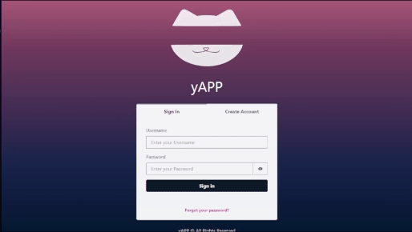
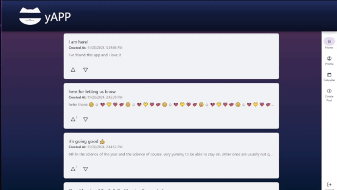
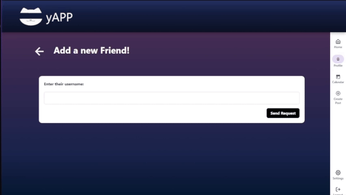
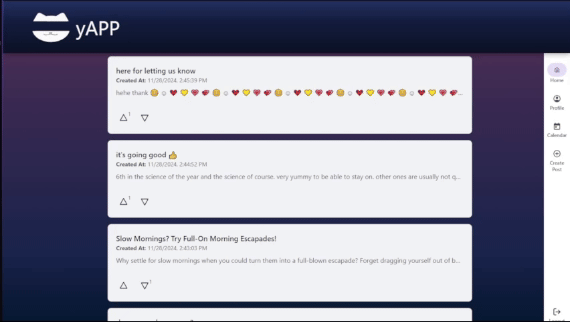
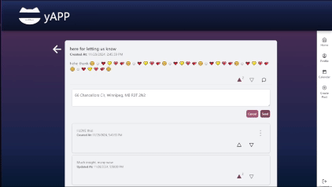
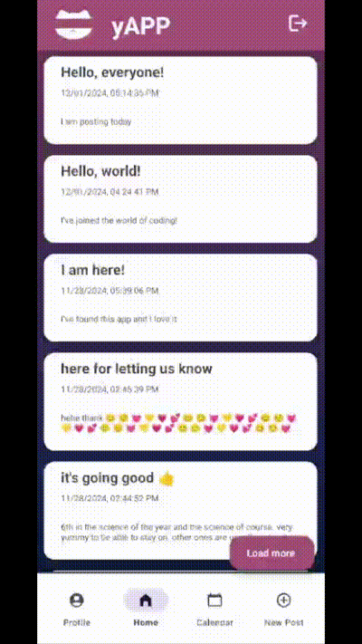
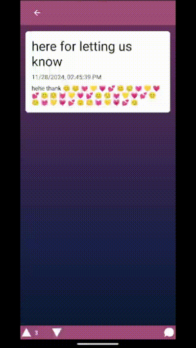
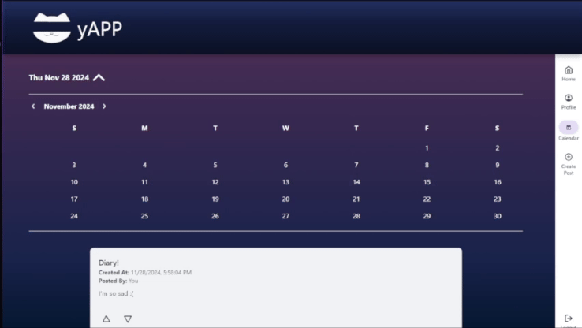
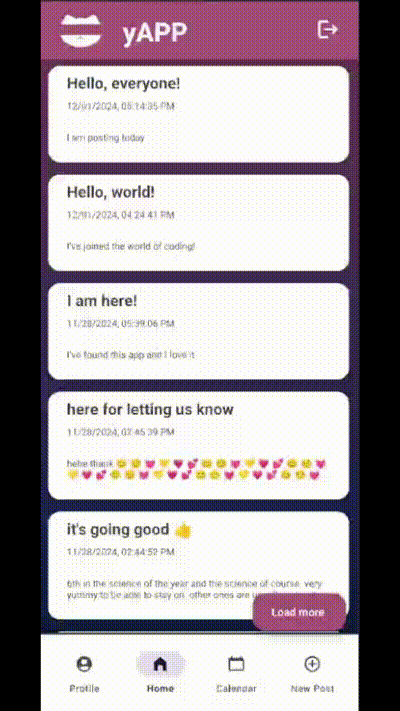
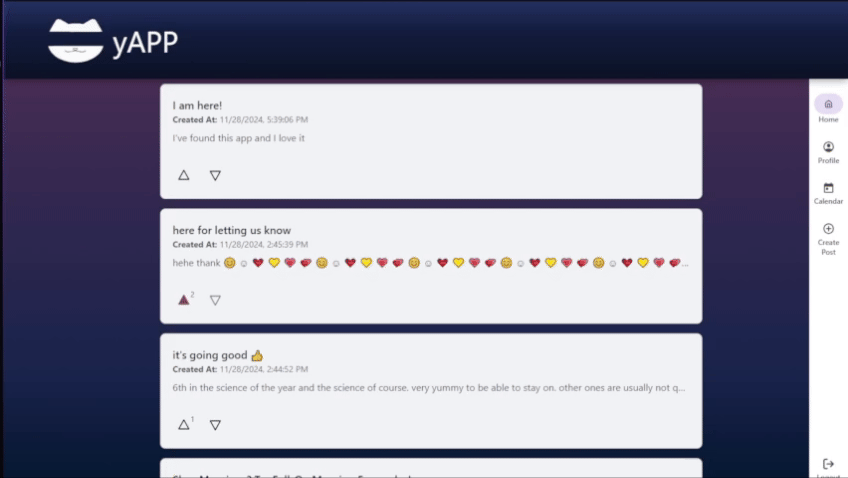

# Welcome to the app demo
This document is used to showcase the various features of this app as its actual functionality will not be available after the Fall 2024 semester. This is due to the fact that our app ran with various AWS integrations and we needed to remove all resources to keep our costs down. As such, we have provided this document as a stand-in. We hope you enjoy!

## Feature 1 - Profile Management
This is a pretty standard feature, and isn't very interesting, but is still showcased here to show what we have done! It should be worth noting that it was difficult to modify how the UI looked for logging in, and as such, we have decided to use the built-in web sign-in page. Additionally, it is not possible to change your password on mobile, so it asks for the user to just change their password on the website.
#### Website:
1. 
2. 
#### Mobile:
1. 
2. 

## Feature 2 - Friendship
This feature was originally a part of the profile management feature, but due to the work required to implement this, we have deemed it worthy of its own demo.
#### Website:
1. 
2. 
#### Mobile:
1. 
2. 

## Feature 3 - Posting
This is the real bread and butter of our application.
#### Website:
1. 
2. 
#### Mobile:
1. 
2. 

## Feature 4 - Post Interactions
Users can comment on posts! They can also upvote and downvote the posts as well. Finally, they can edit or delete their posts/comments if they so desire.
#### Website:
1. 
2. 
#### Mobile:
1. 
2. 

## Feature 5 - Personal Calendar
Users can make a daily diary entry which are only visible to their friends. This is visible on a calendar, allowing for the users to view any diary entries that were made, at any time!
#### Website:
1. 
2. 
#### Mobile:
1. 
2. 

## Feature 6 - Hidden Awards
After users hit certain milestones, they will gain achievements that they can view on their profile, which includes some tiered achievements, as well (not shown in demo, but can be seen in backend files).
#### Website:
1. 
#### Mobile:
1. 
