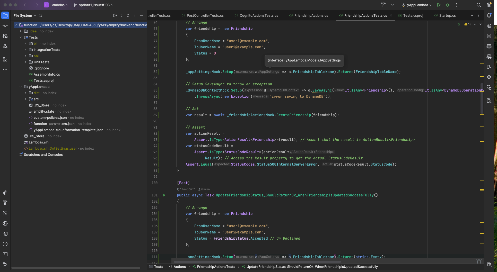

# Get Started Documentation

- [Get Started Documentation](#get-started-documentation)
  - [Duplicate Environment without AWS profile](#duplicate-environment-without-aws-profile)
  - [Backend](#backend)
  - [Web Frontend](#web-frontend)
  - [Mobile Frontend](#mobile-frontend)
  - [Postman](#postman)


## Duplicate Environment without AWS profile

**Note:** This is a cloud-based project, so developers must set up their AWS account and profile to run both the backend and frontend. Without this setup, the necessary resources cannot be located.

However, other teams can still run the unit tests for this project. Please refrain from running the integration tests and the frontend, as the AWS profile is not configured, and the Amazon SDK will be unable to locate the required resources.


1. **Install .NET 6 (SDK 6.0.425)**
    - More information [here](https://dotnet.microsoft.com/en-us/download/dotnet/6.0).
    - Note that the localhost is running on Kestrel webserver. When you first run your localhost, you might need to trust the certificate.
2. **Rider IDE**
    - Recommended for this project. A free one-year subscription is available for students.
        - More information [here](https://www.jetbrains.com/rider/)
    - Set your .NET executable path if multiple versions exist:
        - Go to Settings > Toolset and Build
            - Example:
            
    - Open the solution file:
        - Path: yApp/amplify/backend/function/Lambdas.sln
            - Example:
            
    - **Install Packages**
        - Command line: 
            ```sh
            dotnet restore
            ```
            - Example:
            
        - Rider:
            - Example:
            
    - **Run the Project**
        - Click the play button in Rider.
            - Example:
            
        - Note: The backend will show "This localhost page can't be found" because it is an API backend. View the frontend in the Frontend Section. API details are available at:
            - [https://localhost:54053/swagger/index.html](https://localhost:54053/swagger/index.html)
            - Example:
            
    - **Run the unit tests**
        - Find the UnitTests folder: yApp/amplify/backend/function/Tests/UnitTests
            - Example:
            
        


## Backend

1. **Install .NET 6 (SDK 6.0.425)**
    - More information [here](https://dotnet.microsoft.com/en-us/download/dotnet/6.0).

2. **Install AWS CLI & Setup AWS Profile**
    - More information [here](https://docs.aws.amazon.com/cli/latest/userguide/getting-started-install.html). This is crucial for using Amazon Cognito and DynamoDB SDK.
    - In the Amplify console, create an access key and secret key using your IAM user account. Save these keys for the next step.
    - Create a user profile with the following command, using region: **us-east-2** and output format: **json**:
        ```sh
        aws configure
        ```
    - For multiple profiles:
        ```sh
        aws configure --profile [your profile name]
        ```
    - Example: 
        

3. **Install Amplify CLI & Initialize the Project**
    - More information [here](https://docs.amplify.aws/gen1/javascript/start/getting-started/installation/).
    - After installation, pull this repo and run:
        ```sh
        amplify init
        ```
    - Follow the prompts and set the environment name to **test**. Use the following configuration:
        ```json
        {
            "projectName": "yApp",
            "version": "3.1",
            "frontend": "javascript",
            "javascript": {
                "framework": "vue",
                "config": {
                    "SourceDir": "yAppWeb/src",
                    "DistributionDir": "yAppWeb/dist",
                    "BuildCommand": "npm run-script build",
                    "StartCommand": "npm run-script serve"
                }
            },
            "providers": [
                "awscloudformation"
            ]
        }
        ```

4. **Install Amazon Lambda Tools**
    - Required for backend deployment with Jenkins. For testing cloud settings, use:
        ```sh
        amplify push
        ```
    - If packages are missing, commands will be provided.

5. **Rider IDE**
    - Recommended for this project. A free one-year subscription is available for students.
        - More information [here](https://www.jetbrains.com/rider/)
    - Set your .NET executable path if multiple versions exist:
        - Go to Settings > Toolset and Build
            - Example:
            
    - Open the solution file:
        - Path: yApp/amplify/backend/function/Lambdas.sln
            - Example:
            
    - **Install Packages**
        - Command line: 
            ```sh
            dotnet restore
            ```
            - Example:
            
        - Rider:
            - Example:
            
    - **Run the Project**
        - Click the play button in Rider.
            - Example:
            
        - Note: The backend will show "This localhost page can't be found" because it is an API backend. View the frontend in the Frontend Section. API details are available at:
            - [https://localhost:54053/swagger/index.html](https://localhost:54053/swagger/index.html)
            - Example:
            
    - **Run the unit tests & integration tests**
        - Find the UnitTests folder: yApp/amplify/backend/function/Tests/UnitTests
            - Example:
            
        - Find the IntegrationTests folder: yApp/amplify/backend/function/Tests/IntegrationTests
            - Example:
            

    **Note that if you don't have the AWS profile set up, you can't run the integration tests because you don't have a connection to the resources, but you can still run unit tests.**

## Web Frontend
**Note that to run the frontend, you must complete steps 2 and 3 in the Backend section. Without initializing the Amplify project, the required resource files (such as `aws-exports.js` and `amplifyconfiguration.json`) will not be generated in the frontend.**


1. **Install Node.js**
    - More information [here](https://nodejs.org/en/download/package-manager).
    - After installation, make sure you have npm installed.

2. **Install pnpm**
    ```sh
    npm install pnpm
    ```

3. **Setup Project**
    - Locate the path in the terminal: `yApp/yAppWeb`
    - Run the command:
        ```sh
        pnpm install
        ```
    - Example:
        

4. **Run the project**
    - Locate the path in the terminal: `yApp/yAppWeb`
    - Run the command:
        ```sh
        pnpm run dev
        ```


## Mobile Frontend
**Note that to run the frontend, you must complete steps 2 and 3 in the Backend section. Without initializing the Amplify project, the required resource files (such as `aws-exports.js` and `amplifyconfiguration.json`) will not be generated in the frontend.**
1. **Install Android Studio**
    - More Information  [here](https://developer.android.com/studio?gad_source=1&gclid=Cj0KCQjw6oi4BhD1ARIsAL6pox09idOtTxBZLFgvXvQHLXXL8d9oZJSnCtvuCGeCs51jH7a2puaDobQaAiseEALw_wcB&gclsrc=aw.ds).
    - Set up the SDK platform with minimal api level: 34. By default, we would like to recommend to use Neuxs 7 API 34 device.
2. **Configure SSL**
   - Go to Settings 
   - Click the Server Certificate on the right 
   - Check the "Accept non-trusted certificate automatically"
     - Example:
         

3. **Run the project**
    - Open the yAppMobile folder in the Android Studio and click the play button on the top.


## Postman
To test the backend without running the frontend. **Note that to run the frontend, you must complete steps 2 and 3 in the Backend section. Without initializing the Amplify project, the sdk can't locate the resources**
- **Install Postman**
    - Download and install Postman from [here](https://www.postman.com/downloads/).
    - Create an account to use Postman.
- **Import Environments**
    - Find the postman folder: yApp/amplify/backend/function/yAppLambda/src/Postman
    - Import the  environment
        - Import yApp Api environment.postman_environment
            -  Example:
                
        - Adjust settings:
            - Example:
                

            - **isLocal**: Set to `true` when testing the localhost environment, or `false` when testing the cloud endpoint.
            - **baseUrl**: The endpoint URL. Refer to the default values provided on the right. If testing locally, set this to `https://localhost:54053`.
            - **Authentication**: You must provide a valid Cognito username and password to execute this Postman request.
    - Import collections:
         - Example:
             
    - Test the collections:
        - Example:
             


