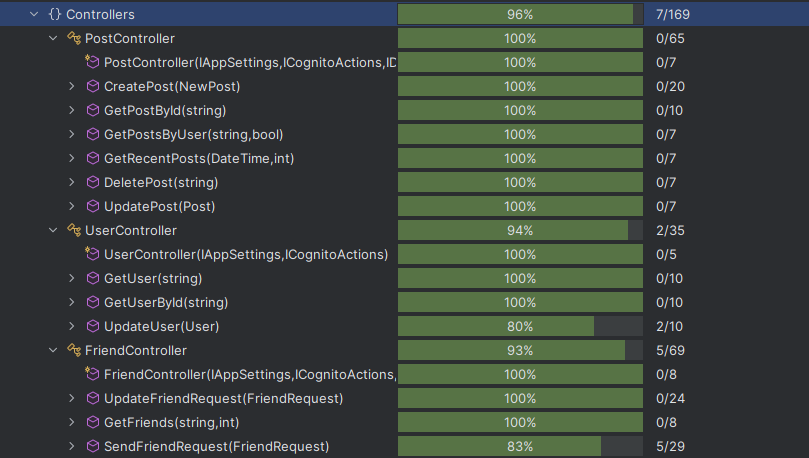
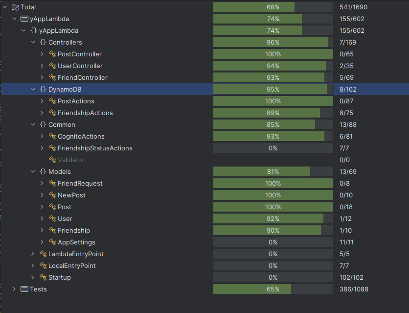
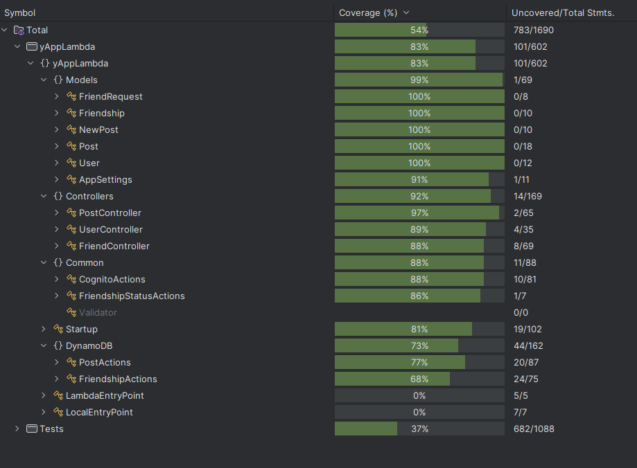

# yApp

## Test Plan
 - The test plan for our project can be found [here]()

## Unit/Integration/Acceptance Tests
### Backend
#### API layer coverage

 - Every method in our API layer has been tested up to at least 80% of the lines in the methods.

 #### Logic layer line coverage
 
 - Every element of our logic layer has at least 80% line coverage.

 #### Integration test coverage
 
 - Our integration tests cover all of our logic layer classes, most of which have over 80% line coverage. Some classes have less than 80% line coverage due to it not being feasible to test every single exception within each method in these classes in the integration tests, though each method is tested within all of those classes.

### Frontend
#### Frontend logic layer
 - Our frontend has no logic layer, so we did not need to write any tests for that.

#### Acceptance tests
 - We've written automated acceptances tests using JUnit for our Android app.
    - These can be found under yAppMobile > app > src > androidTest > tests.
    - We chose this way of testing our app to make it easier and quicker to run these tests.
 - We've written manual acceptance tests for our website.
    - We chose this way of testing our website because we were unsure of how to write automated tests for our website, but we still want to ensure everything is running properly. 
    - For this, we've provided detailed instructions for running through each of our user stories under Documentation > Acceptance Tests.

### Other information on our testing approach
 - Due to the way we set up our project, we need to run system tests to test the integration of the logic/api layer with the database. We called these integration tests, which is what the information in our integration tests section is referring to.
 - To have our integration tests run in a timely manner, we re-use the same test user in our live database. We do this by creating a user in one integration test and deleting it in another, which we ensure runs smoothly by enforcing the order these integration tests are executed. We start with the test that creates the test user, then any of the other tests that also use that user, and finally we run the test that will delete the user.
 - We are only able to provide a line coverage report as Rider, the IDE we’re using for development, does not offer class or method coverage reports.

## Test Importance
### Our 3 most important unit tests
1. CreateUser_ShouldCallAdminCreateUserAsync() - from CognitoActionsTests
    - This tests if the method CreateUser() calls .AdminCreateUserAsync(), which is required to create a user in the database, and sends the correct response when a user is created successfully.
2. CreateFriendship_ShouldReturnOk_WhenFriendshipIsCreatedSuccessfully() - from FriendshipActionsTests
    - This tests if the method CreateFriendship() calls .SaveAsync(), which is required to create a friendship in the database, and sends the correct response when a friendship is created successfully. 
3. CreatePost_ShouldReturnOK_WhenPostIsCreatedSuccessfully() - from PostActionsTests
    - This tests if the method CreatePost() calls .SaveAsync(), which is required to create a post in the database, and sends the correct response when a post is created successfully.

### Our 3 most important integration tests
1. GetUserById_ShouldReturnFound_WhenUserExist() - from UserControllerTests
    - This tests if a user exists in the database by the user ID, which will return a user object if the user if found.
2. SendFriendRequest_ValidRequest_ReturnsFriendship() - from FriendControllerTests
    - This tests if a friend request was created successfully in the database, which will return a new friendship object.
3. CreatePost_ValidRequest_ReturnsPost() - from PostControllerTests
    - This tests if a post was created successfuly in the database, which will return the new post object.

### Our 3 most important acceptance tests
1. Creating a new post - Documentation > Acceptance Tests > Posting.md > "Creating New Post" section
    - This tests the user experience of creating a new post as well as tests the connection between the frontend and backend when creating a new post. This is tesing our [Make Public Question Posts](https://github.com/KageSilver/yAPP/issues/7) user story.
2. Creating a new account - Documentation > Acceptance Tests > Profile Management.md > "Account Creation" section
    - This tests the user experience of creating a new account as well as tests the connection between the frontend and backend when creating a new account. This is testing our [Account Creation](https://github.com/KageSilver/yAPP/issues/20) user story.
3. Logging into an existing account - Documentation > Acceptance Tests > Profile Management.md > "Account Login" section
    - This tests the user experience of logging into an existing account as well as tests the connection between the frontend and backend when logging into an account. This is testing our [Account Login](https://github.com/KageSilver/yAPP/issues/21) user story.

## Reproducible Environments
#### Was the documentation clear enough to run their software? Did you get it running? Now long did it take, was it hard?
 - 
#### Could you run the unit tests (SHOW IMAGES)? Did they all work? What about integration tests and other tests?
 - 
#### Were there any issues you found when running the software? Connection issues, other problems, especially with it being a distributed system.
 - 
