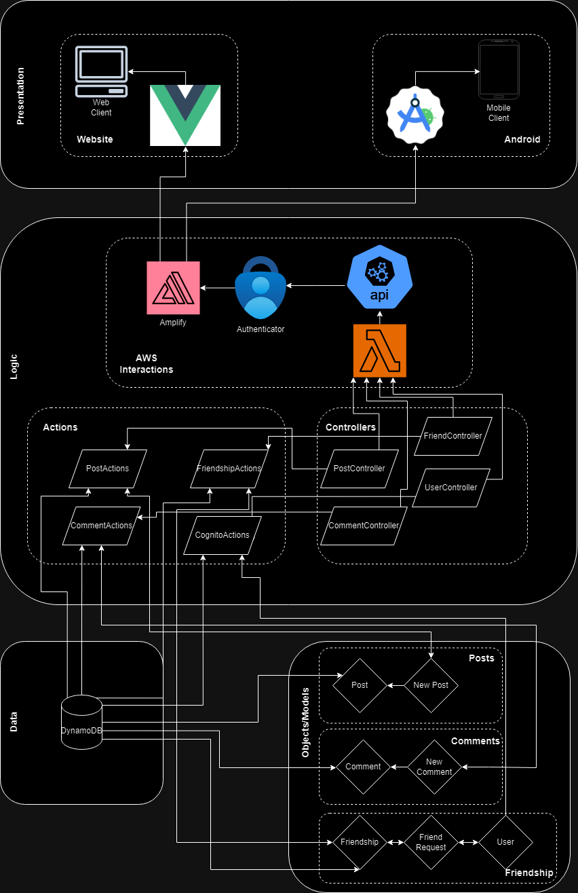
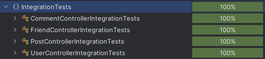
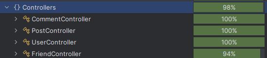
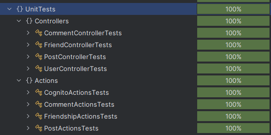
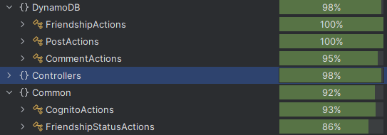

# yAPP // Sprint 2 Worksheet

## Regression Testing
1. We run our regression testing by ...
2. Here are the various links for regression testing.
    - [Here](.) is the regression testing script.
    - Here is the last snapshot of the execution:
    - Here are the results of regression testing:

## Testing Slowdown
We have been able to keep all of the unit and integration tests in our test plan as we haven't experienced any significant slowdown. We have simply added on to our test plan from Sprint 1 rather than creating an entirely new version for Sprint 2. All of our tests can be run under a minute in our local deployments and are then run automatically by our CI/CD pipeline. Due the speed and necessity of our tests, we decided not to change our test plan for the different releases.

## Not Testing
Here is our current system diagram:

Here is what we haven't tested:
* We were unable to automate testing for the presentation layer of our application, and as such, we have written manual acceptance tests. These tests can be executed by an operator to ensure that everything is working as intended.
* We also did not test our models/objects as they as simply structs without any testable functions within them.

And here is the testing for each of the layers in our tiers:
- Presentation:
    Not automatically implemented, so line coverage is not included as a coverage report. However, due to us writing manual tests, we have covered every *intended* use case of our application, covering all of our user stories.
    * Website layer: 
        - **Fully tested (80%+)**
        - [Acceptance tests folder](../Acceptance%20Tests/)
    * Mobile layer: 
        - **Fully tested (80%+)**
        - [Acceptance tests folder](../Acceptance%20Tests/)

- Logic:
    * AWS Interactions: These are tested with our integration tests as we are interacting diretly with our database on the cloud and with our endpoints. 
        - **Fully tested (80%+)** 
        - 
        - 
    * Controllers: These are tested with both our integration tests and our unit tests. It acts as the bridge between our cloud infrastructure and the logic with our APIs that are managed in the `Actions` files. 
        - **Fully tested (80%+)**
        - 
        - 
        - 
    * Actions: These are tested simply through unit tests. These execute our API calls and require database mocks for the expected behaviour of our program.
        - **Fully tested (80%+)**
        - 
        - 

- Data:
    * DynamoDB: This tier/layer is tested through the tests for our actions.
        - **Fully tested (80%+)**
        - 

- Objects/Models:
    * These object models are simply models for the database and do not require testing.
        - **Not tested**

You can find the full coverage report [here](./Reports/CoverageReport.json).

## Profiler
- Slowest Endpoint:
    - The slowest endpoint appeared to be the "GetDirariesByFriends" endpoint. This is likely due to the fact that it sends API calls for each of the user's friends and has to wait for its response every time. 

- Is it fixable:
    - This could probably be fixed by reducing the amount of time that we spend waiting for a response. However, since we're only using the free tier for AWS, we are unable to use the fastest tier and expect our API calls to require more time to load.

- Profiler output:
    - [Here is the output](./Reports/yAppLambda%20-%20[2024-11-03%2014-57-17].dtt).

## Last Dash
Sprint 2 involved many tears induced via storage constraints for our CI/CD pipeline, and we definitely would not be surprised if we face this problem again in the upcoming sprint, as it is something that is out of our control.

As for our code and remaining feature issues we plan on implementing, we are confident that we can complete the work in the allotted time as the majority of the framework has already been built, and we plan on improving our code should we come across any problems once we complete these issues.

## Show Off
- Cynthia:
    Stuff here with commit.
- Kelly:
    - I think my best work on the project has been the design prototypes and mobile UI refactoring. I created the layout plans for both frontends and did a huge overhaul of our mobile app in Sprint 2. Juggling all of these responsibilities while trying to complete my other dev tasks was definitely rough, but seeing everyone's reactions to the final product made me so happy. I'm super proud of my group and our project, and I wanted to try my best to come up with a design the captured just how awesome both are.
    - Here is a [link to the  design plans](https://www.figma.com/design/PH7j5a65cGKczLGycxOng0/yAPP?node-id=1-5756&t=xX75vDgmpQ9P0uug-1).
    - Here is a [link to the PR containing the mobile refactoring](https://github.com/KageSilver/yAPP/pull/254).

- Qiwen:
    Stuff here with commit.
- Tara:
    - I'd say that the code I'm most proud of would be some of the mobile frontend code I did for Sprint 1. This piece of code includes making an API call through Amplify within Android Studio. The reason why I'm proud of this piece is because it took a lot of research and a lot of debugging to figure out how to get it to work well. This addition allowed for the others on my team to reuse this code fragment for their own endpoint interactions for other frontend work.
    - Here is the [link to the commit](https://github.com/KageSilver/yAPP/commit/e56907e2eb8d5947cdef8dc9e143b5a36744095b).

