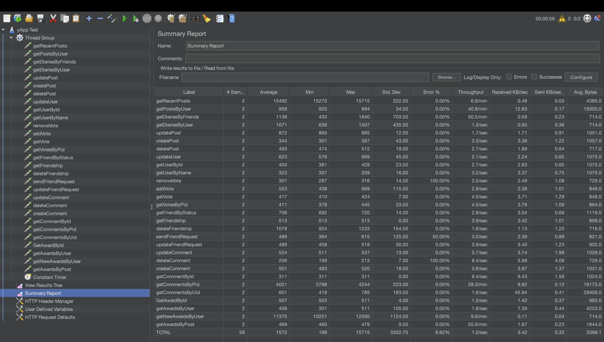
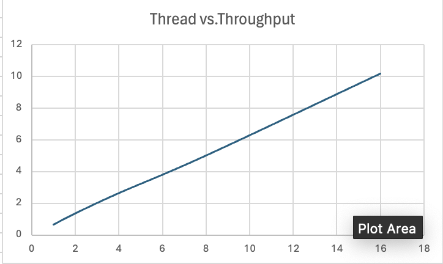
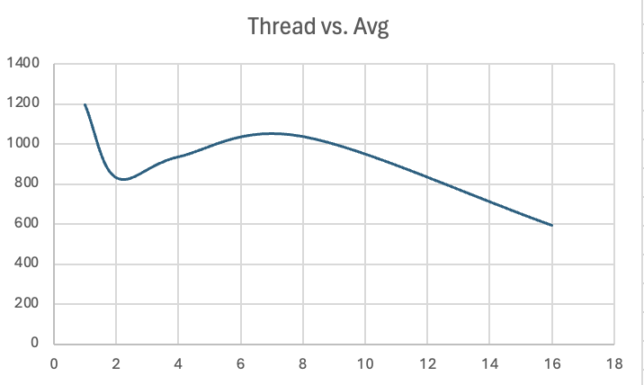
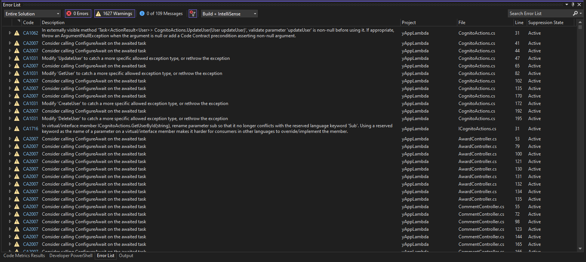

# yAPP // Sprint 3 Worksheet

## Load Testing

#### 1. Environment
Test Plan : [TestPlan](./Jmeter/yApp%20Test.jmx)
- Tool: Apache JMeter
- Endpoint: https://cw1eg57r56.execute-api.us-east-2.amazonaws.com/test
  - This is a test environment hosted on AWS Lambda with a memory size of 128 MB.
- Test Cases
  - Since we are limited by Lambda’s memory size and mindful of AWS costs, the load testing focuses on analyzing performance across various concurrency levels (1, 2, 4, 8, 16 threads). The following test scenarios are conducted:
     - Loop Count: 1
     - Ramp up Period: 5
     - Thread Level: 1,2,4,8,16

#### 2. Test Reports

To demonstrate a successful test run, we have included a screenshot showing the results for 2 threads. However, for the other thread levels, the results were saved directly to a CSV file, and unfortunately, screenshots were not captured.
    - Screenshot: 
  - 1 Thread:  [Report 1](./Jmeter/summary_1.csv)
  - 2 Threads: [Report 2](./Jmeter/summary_2.csv)
  - 4 Threads: [Report 4](./Jmeter/summary_4.csv)
  - 8 Threads: [Report 8](./Jmeter/summary_8.csv)
  - 16 Threads: [Report 16](./Jmeter/summary_16.csv)
#### 3. Bottleneck found in the load testing
According to the summary_thread16.csv: 

   - High Latency
     -  Operations with the highest average and max latencies
       - `getCommentsByPid`: Average = 2162 ms, Max = 3897 ms
       - `getNewAwardsByUser`: Average = 6097 ms, Max = 12298 ms
       - `getRecentPosts`: Average = 1858 ms, Max = 14607 ms
   - Inefficient operations
     - From the above analysis, it is evident that `getCommentsByPid` and `getNewAwardsByUser` exhibit high latency, which correlates with their low throughput. This suggests that these operations are inefficient and may require optimization.
       - `getCommentsByPid` has relatively low throughput at 0.78958.
       - `getNewAwardsByUser` has very low throughput at 0.57176.
   - High Error Rate
     - High error rates can indicate system instability or the presence of specific bottlenecks. For the `removeVote` and `deleteComment` operations, the provided IDs were intentionally non-existent, so the 100% error rate for these actions is expected. However, unexpected errors were observed in the `sendFriendRequest` , `updateFriendReques` and other operations, which require further investigation.
       - `removeVote` (100% error rate)
       - `deleteComment` (100% error rate)
       - `sendFriendRequest` (56.25% error rate)
       - `updateFriendRequest` (43.75% error rate)
       - ...
  
   - Inconsistent performance
     - High variability (Std. Dev.) indicates inconsistent performance, making the operation less reliable.
       - `getRecentPost`: Std. Dev. = 3303.7
       - `getNewAwardsByUser`: Std. Dev. = 4930.52
       - `createPost`: Std. Dev. = 3149.3
#### 4. Does it meet the non-functional requirements?
Given the constraints of Lambda’s memory size, currently set at 128MB, and the need to manage AWS costs, the load testing was conducted to analyze performance across various concurrency levels (1, 2, 4, 8, and 16 threads). The objective was to evaluate performance trends and determine whether the system meets the defined non-functional requirements.

In our proposal, we specified the need to manage a user pool of 1,000 monthly active users, including activities such as sign-up, sign-in, password changes, and account updates. While constrained by the free tier and the 128MB memory allocation, the ideal scenario would involve upgrading to a paid plan with increased resources, enabling the system to achieve the desired performance and scalability.

  1. Throughput vs. Threads
       -  
  2. Latency vs. Threads
       -  
       -  AWS Lambda functions experience latency spikes during cold starts, which occur when a function is invoked for the first time or after being idle. These spikes are due to the initialization process.
    
  ***Did you meet your goals? - No, but the goal could be achieved with additional resources.***

  Current Performance at 128MB Memory: At 16 threads, the system achieves a throughput of 10.18035 requests/second. This supports approximately 16 concurrent users comfortably.  To meet the requirement of 1,000 users, the system needs to scale by a factor of:  Scaling Factor = Target Throughput / Current Throughput  = 1000 / 10.18035 ≈ 98.2 This implies the current setup cannot meet the requirement without scaling the system significantly.

  However, throughput scales linearly with threads (Up to 16 Threads). The system demonstrates predictable scaling, doubling throughput as threads increase, indicating efficient use of resources at 128MB memory. This trend suggests the system has the potential to scale further. 

  In conclusion, While the system currently does not meet the non-functional requirement of supporting 1,000 users, the observed linear scaling trend indicates that the goal is achievable with increased resources. Strategic investments in memory upgrades (eg. 1024 MB), provisioned concurrency, and architectural optimizations would allow the system to scale efficiently to meet the target.

## Security Analysis
1. Our group looked at a WIDE variety of tools to run our static code analysis, but due to time constraints we decided to stick to the built-in tools provided by the IDEs we currently use. We looked at extensions from VS Code or the built-in analyzer from Visual Studio, but it simply was not working on its own. We then turned to the next possible option suggested by the good old internet, using the Roslyn code analyzer that could be installed through NuGet (specifically Microsoft.CodeAnalysis.FxCopAnalyzers - the latest version) which is compatible with our main language, C#. Then, we simply rebuilt our project with this security-oriented package. By doing this, we were able to output more security-focused errors in the Error List in Visual Studio. The output of our analysis shows that we have no critical security risks or errors. However, it did helpfully show that we had over 1500 warnings with 100 suggestions... To make sure we weren't missing anything, we also ran ReSharper with our IDE Rider. It showed similar results and provided a complicated to understand xml file as output. We've attached the link to it in the appendices of this document along with a screenshot of the output from the first analysis.

2. Upon inspecting the multitude of warnings that appeared in our code analysis, there was definitely a certain pattern that could be found. However, we're just going to analyze five random warnings that appeared.
    - "Modify 'UpdateUser' to catch a more specific allowed exception type, or rethrow the exception": Upon double clicking on this issue, it outlines the [function in question](../../amplify/backend/function/yAppLambda/src/Common/CognitoActions.cs#47). We can see from the code that we wrote that there is definitely probably a better Exception that could have been thrown. Perhaps a good course of action could have been to create an entire custom Exceptions class such as the one we used in 3350 so that we are throwing and catching the right exceptions. Additionally, the exception message could potentially be more descriptive. 
    - "Do not use Assert.Equal() to check for collection size": Double clicking this error brings us to one of our [test files](../../amplify/backend/function/Tests/UnitTests/Controllers/PostControllerTests.cs#666). As the warning states, it says that we probably shouldn't be using the equal function to test for the length of the list being returned. Perhaps we should be looking into using a more specific Assert function as opposed to just equal. But as this is one of the test files, I am sure that it's fine if we have some vulnerabilities such as these.
    - "Consider calling ConfigureAwait on the awaited task": [This file](../../amplify/backend/function/yAppLambda/src/DynamoDB/VoteActions.cs#235) is where this warning is referring to. It would appear as though it is suggesting that we should be using a more robust function to await for the results as opposed to simply using the `await` function. Perhaps this could fix some of the flaky tests that we were getting with differing network/device speeds when running tests?
    - "Remove the underscores from member name Tests.UnitTests.Controllers.PostControllerTests.GetRecentPosts_ShouldReturnBadRequest_WithInvalidRequest()". There are quite a lot of warnings for our test files, where it is mostly complaining about how we've named our tests, like in [this file](../../amplify/backend/function/Tests/UnitTests/Controllers/PostControllerTests.cs#441). This issue certainly seems more like a coding standards warning and could probably be suppressed and ignored as it does not pose any sort of security threat to our system.
    - "Count() is used where Any() could be used instead to improve performance". While this is more of a performance issue, it is still a helpful warning. If our endpoints are slow, it could leave us vulnerable to attacks from outsiders, so trying to maximize performance is pretty important, and something we strove to do in our algorithm designs. However, it would seem that there are always ways to improve, as shown [here](../../amplify/backend/function/yAppLambda/src/DynamoDB/AwardActions.cs#290).

3. As our project did not produce any errors, we have no critical problems to solve. No commits for fixing code will need to be made, and we will instead be discussing two of the more common warnings that appeared in the analysis.
    - "'IDynamoDBContext.DeleteAsync<T>(T, DynamoDBOperationConfig, CancellationToken)' is obsolete: 'Use the DeleteAsync overload that takes DeleteConfig instead, since DynamoDBOperationConfig contains properties that are not applicable to DeleteAsync.'": This warning in particular is one that has shown up in a lot of places throughout our code, particularly whenever we are performing database actions (not just Delete). [This example](../../amplify/backend/function/yAppLambda/src/DynamoDB/CommentActions.cs#175) specifically shows that our usage of the dynamodb functions may not be the most appropriate. However, a big part of this is due to the lack of documentation that DynamoDB has, and it has been working for our application. But this does potentially leave an opening for weird properties being passed into our database, maybe causing catastrophic errors.
    - "The behavior of 'DateTime.ToString(string)' could vary based on the current user's locale settings. Replace this call in 'PostActions.GetRecentPosts(DateTime, int)' with a call to 'DateTime.ToString(string, IFormatProvider)'". We've had many issues surrounding datetime, and this warning suggests that [this usage](../../amplify/backend/function/yAppLambda/src/DynamoDB/PostActions.cs#238) could potentially be the culprit/cause for all of our problems! This warning is helpful for outlining where our app may fail if it were to receive an invalid datetime format based on where the user is from. Knowing this, perhaps it may have helped with time spent debugging datetime formatting errors from the backend communicating to the frontend. 

## Continuous Integration and Deployment (CI/CD)

## Thoughts

Our project design worked well for us for the most part, though there are a few things we would change when looking back on our development. While we had scoped most of our features quite well, our Profile Management feature ended up being two features in one due to the Friends user story. At this point in the project, we all consider the Friendship aspect of our application to be it's own feature due to the time and effort it took to get it working. If we had considered Friends a feature on it's own since the beginning, our sprint 1 workload would have been scoped much better. On the more technical side, we would have chosen a different frontend framework for our mobile app that would offer more cross platform availability and easier usage overall for us as developers. We initially planned to use .NET MAUI but pivoted to Kotlin last minute due to time constraints in sprint 1. Finally, while DynamoDB didn't cause us too many issues, we could have chosen a different database that had better documentation and was easier to integrate into our backend.

## Other Thoughts

Overall, we thought this project had a good setup and allowed for students to have more agency in the project compared to most Computer Science assignments. While the requirements for actual implementation create the space for students to have freedom with the project, we think that further requirements could be implemented to ensure students can keep their projects on track, such as communication, time management, and organization. There could also be more pointers to where to find information on technologies that could be used in this project for groups that have no idea where to start.

# Appendix for Security Analysis
Here is a screenshot of the output from building the project and viewing the error list window with code analysis turned on.

[Here is the report](./Resources/InspectionReport.xml) produced by the static analysis tool when running the security analysis tool on our source code.